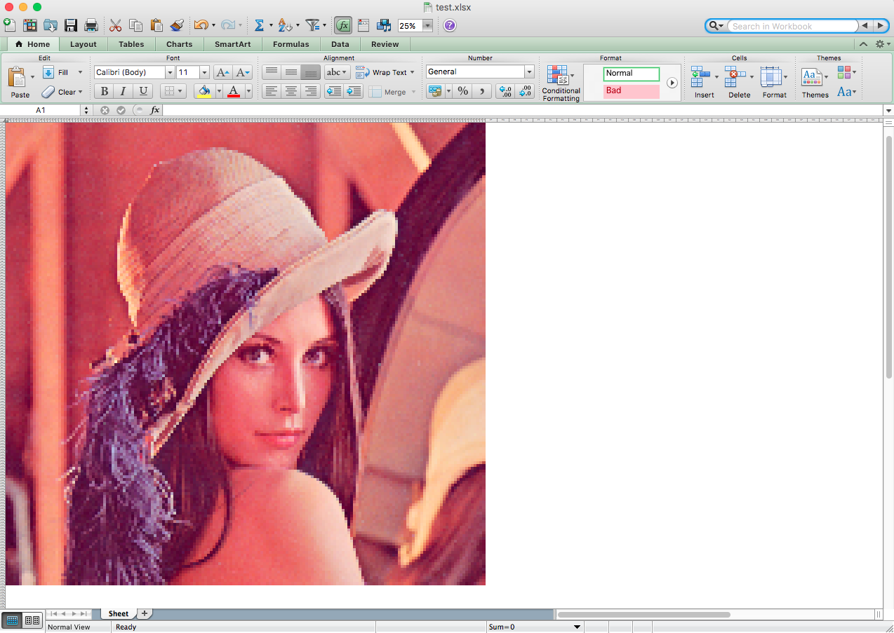

xlart
=====

Excel art generator



Installation
------------

```bash
    python setup.py install
```

Usage
-----


```bash
    xlart image.png destination.xlsx
```

You can control the downsampling with the --scale argument. 

```bash
    # output 1 cell for every 3 pixels of the image
    xlart image.png destination.xlsx --scale=3
```

Troubleshooting
---------------

If you have problems installing Pillow on macOS try this, then try
installing again.

```bash
    pip install --upgrade pip
    pip install Pillow
```
